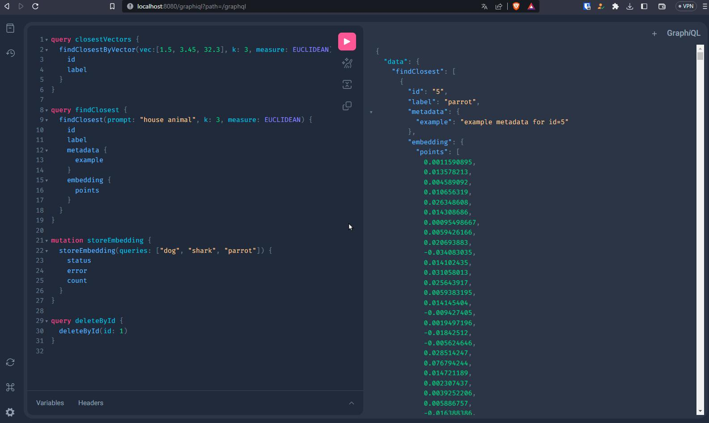

# MaxVector
A locally running vector database with GraphQL API, with built-in methods to obtain embeddings from OpenAI 
and other services. Written in Kotlin using Spring, with Postgres as the storage. Vector similarity provided 
by ultra fast algorithms of the [Faiss](https://github.com/facebookresearch/faiss) library.

## Why?
One day I tried to get Pinecone access and they put me on a wait list! I'm too impatient, so I just created a vector database myself.

## What does it do?
MaxVector is a vector database created for AI applications, so you can use it exactly like any other vector db - to store your
embeddings and query closest ones by distance (using euclidean, cosine or inner product) or metadata and query it
by using GraphQL for fine-grained field selection. Example of storing OpenAI embeddings for dog, shark and parrot using
plain Python code:

```python
    get_closest_vectors = """mutation storeEmbedding {
    storeEmbedding(queries: ["dog", "shark", "parrot"]) {
    status
    error
    count
    }
    }"""

    payload = {"query": get_closest_vectors}
    r = requests.post(url, json=payload)
    json_data = r.json()

    data = json_data["data"]["storeEmbedding"]
    status = data["status"]
    error = data["error"]
    count = data["count"]
```

## Any other features?
Oh, sure. It can obtain embeddings automagically for you! With GraphQL interface it's enough to call this mutation to 
obtain embedding vectors for a list of words from OpenAI **straight into your database**:

```GraphQL
    mutation storeEmbedding {
      storeEmbedding(queries: ["dog", "shark", "parrot"]) {
        status
        error
        count
      }
    }
```

Or it could lookup embeddings in your database by prompt, first obtaining the embedding from OpenAI, like here:

```GraphQL
    query findClosest {
      findClosest(prompt: "house animal", k: 3, measure: COSINE) {
        id
        label
        metadata {
          example
        }
        embedding {
          coords
        }
      }
    }
```

If you prefer to query the DB by supplying all 2048 coordinates, you can of course do that, too:

```GraphQL
    query closestVectors {
      findClosestByVector(vec:[1.5, 3.45, 32.3, (2045 more coords...)], k: 3, measure: EUCLIDEAN) {
        id
        label
      }  
    }
```



Of course - more features will be added as necessary.

# Installation
All you need is a local instance of Postgres with [pgvector](https://github.com/pgvector/pgvector) extension and a JAR build from this repo.

## Installing and configuring Postgres

On any Debian-ish Linux install Postgres by:

```shell
    $ sudo apt-get install postgresql
```

Then configure admin user and password:

```shell
    $ sudo -u postgres psql postgres
```

And in Postgres shell:

```shell
    postgres=# \password postgres
```

To set up password for the postgres user, which is empty by default. You can then exit Postgres shell, and create
a new database user - this is the user you will need to put in `application.properties` file later:

```shell
    $ sudo -u postgres createuser --interactive --password user12
    Shall the new role be a superuser? (y/n) n
    Shall the new role be allowed to create databases? (y/n) y
    Shall the new role be allowed to create more new roles? (y/n) n
    Password: 
```

Create a db - whatever name you choose you will need to use it in `application.properties` file later:

```shell
    $ sudo -u postgres createdb testdb -O user12
```

Finally edit your postgres config file to trust locally running MaxVector:

```shell
    $ sudo vi /etc/postgresql/9.5/main/pg_hba.conf
```

Edit the file like this:

```shell
    # "local" is for Unix domain socket connections only
    local   all             all                                     trust
    # IPv4 local connections:
    host    all             all             127.0.0.1/32            trust
```

And restart postgres service:

```shell
    $ sudo service postgresql restart
```

## Installing Postgres vector extension

Go to [pgvector GitHub](https://github.com/pgvector/pgvector#installation) and check the installation section 
there to install Vector extension.

## Configuring MaxVector

Edit `src\main\resources\application.properties` file, add `openAIapiKey` line with your OpenAI API key:

    spring.datasource.url=jdbc:postgresql://localhost:5432/<the name of the db>
    spring.datasource.username=<the non-admin user you added>
    spring.datasource.password=<the user's password>
    
    openAIapiKey=sk-<your-openAPI-key>

## Build the application

Use Gradle.

# Reference

Query the db with GraphQL, either by plain HTTP requests or any GraphQL client, like [Apollo](https://github.com/apollographql)
or the built-in web interface on port [8080](http://localhost:8080/graphiql?path=/graphql) of your machine.
Check `src\main\resources\graphql\schema.gqls` for currently implemented queries and mutations.

Note that first insert into the database will determine dimensionality of the vectors it holds.

## Query closest vectors by vector

You can lookup k closest vectors by supplying its coordinates with float array and adding an optional measure (EUCLIDEAN,
COSINE, INNER_PRODUCT). Defaults to EUCLIDEAN. For normalized vectors (like OpenAI embeddings) choose INNER_PRODUCT for
speed.

```GraphQL
    query closestVectors {
        findClosestByVector(vec: [1.5, 3.45, 32.3,...], k: 3, measure: COSINE) {
            id
            label
        }
    }
```

## Query closest vector by text

Lookup k closest vectors by obtaining the embedding first from selected embedding API:

```GraphQL
    query findClosest {
        findClosest(prompt: "house animal", k: 3, measure: INNER_PRODUCT) {
            id
            label
            metadata {
                example
            }
            embedding {
                coords
            }
        }
    }
```

## Obtain distance

Get distances from selected vector:

```GraphQL
    query getDistance {
        getDistance(vec: [243, 323, 23,...], measure: EUCLIDEAN)
    }
```

## Insert vector

## Insert embeddings

You can store new vectors by obtaining the embedding first from selected embedding API:

```GraphQL
    mutation storeEmbedding {
        storeEmbedding(queries: ["dog", "shark", "parrot"]) {
            status
            error
            count
        }
    }
```

## Upsert

## Update

Vector with a specific ID can be updated by:

```GraphQL
    mutation update {
        updateById(id: 23, vec: [2.3, 2.6,...], label: "New label")
    }
```

## Delete

To delete a vector with particular ID:

```GraphQL
    mutation deleteById {
        deleteById(id: 1)
    }
```

## Create index

You can create an index with all available measures:

```GraphQL
    mutation cosineIndex {
        createIndex(lists: 500, measure: COSINE) {
            status
            error
        }
    }
```